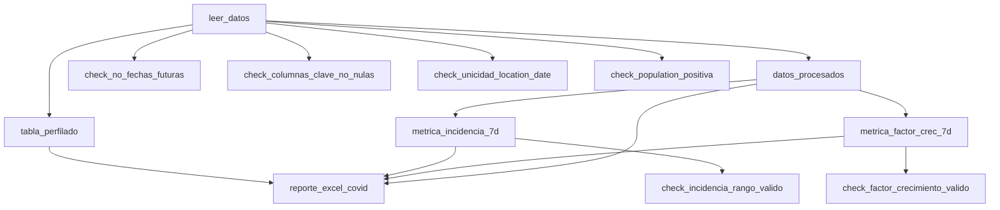

# Informe Técnico: Pipeline de Análisis de Datos COVID-19

**Proyecto:** Análisis Epidemiológico de COVID-19 para Ecuador y Perú  
**Herramienta:** Dagster  
**Fecha:** Enero 2025  
**Autor:** Sistema de Análisis COVID-19

---

## 1. Resumen Ejecutivo

Este proyecto implementa un pipeline completo de ETL (Extract, Transform, Load) usando Dagster para el análisis epidemiológico de datos de COVID-19, enfocándose en la comparación entre Ecuador y Perú. El sistema procesa datos de Our World in Data (OWID) y genera métricas epidemiológicas clave para apoyar la toma de decisiones en salud pública.

**Resultados clave:**
- Pipeline robusto con 8 assets principales y 7 validaciones de calidad
- Generación automática de métricas epidemiológicas estandarizadas
- Sistema de validación de datos de entrada y salida
- Exportación completa a Excel con 5 hojas de análisis

---

## 2. Arquitectura del Pipeline

### 2.1 Diseño General

El pipeline sigue una arquitectura modular basada en Dagster Assets, organizados en 4 grupos funcionales:

```
📊 INGESTA_DATOS
   └── leer_datos
   └── tabla_perfilado

🔍 PROCESAMIENTO  
   └── datos_procesados

📈 METRICAS
   └── metrica_incidencia_7d
   └── metrica_factor_crec_7d

📋 REPORTES
   └── reporte_excel_covid
```

### 2.2 Diagrama de Dependencias



### 2.3 Assets Implementados

| Asset | Tipo | Descripción | Dependencias |
|-------|------|-------------|--------------|
| `leer_datos` | Ingesta | Descarga datos COVID-19 desde OWID | - |
| `tabla_perfilado` | Exploración | Genera perfilado básico de datos | leer_datos |
| `datos_procesados` | Procesamiento | Limpia y filtra datos para Ecuador/Perú | leer_datos |
| `metrica_incidencia_7d` | Métrica | Calcula incidencia acumulada 7 días | datos_procesados |
| `metrica_factor_crec_7d` | Métrica | Calcula factor crecimiento semanal | datos_procesados |
| `reporte_excel_covid` | Reporte | Exporta resultados a Excel | todos los anteriores |

---

## 3. Decisiones de Validación

### 3.1 Validaciones de Entrada

Se implementaron 5 Asset Checks sobre los datos crudos:

| Validación | Regla | Justificación |
|------------|-------|---------------|
| **Fechas Futuras** | `max(date) ≤ hoy` | Prevenir datos inconsistentes por errores de sistema |
| **Columnas Clave** | `location, date, population` no nulos | Asegurar integridad referencial básica |
| **Unicidad** | Única combinación `(location, date)` | Prevenir duplicación de registros diarios |
| **Población Positiva** | `population > 0` | Validar denominadores para métricas per cápita |
| **Casos No Negativos** | `new_cases ≥ 0` permitiendo excepciones documentadas | Detectar correcciones retrospectivas |

**Estrategia de manejo:** Las validaciones fallan documentan pero no interrumpen el pipeline, permitiendo análisis con warnings para casos edge conocidos (ej. correcciones retrospectivas de casos).

### 3.2 Validaciones de Salida

Se implementaron 2 Asset Checks sobre las métricas calculadas:

| Métrica | Validación | Rango Esperado | Justificación |
|---------|------------|----------------|---------------|
| **Incidencia 7d** | Rango válido | [0, 2000] casos/100k hab | Basado en máximos históricos observados |
| **Factor Crecimiento** | Valores positivos | > 0 | Factores negativos indican errores de cálculo |

---

## 4. Métricas Epidemiológicas Implementadas

### 4.1 Incidencia Acumulada a 7 Días

**Fórmula:**
```
incidencia_diaria = (new_cases / population) * 100,000
incidencia_7d = promedio_móvil_7d(incidencia_diaria)
```

**Interpretación:** Standardiza la comparación entre países con diferentes poblaciones y captura tendencias recientes suavizando variabilidad diaria.

**Implementación técnica:**
- Ventana deslizante de 7 días por país
- Mínimo 1 período para evitar NaN en días iniciales
- Redondeo a 2 decimales para legibilidad

### 4.2 Factor de Crecimiento Semanal

**Fórmula:**
```
casos_semana_actual = sum(new_cases_últimos_7_días)
casos_semana_anterior = sum(new_cases_7_días_previos)
factor_crec_7d = casos_semana_actual / casos_semana_anterior
```

**Interpretación:**
- `factor > 1.0`: Crecimiento exponencial
- `factor = 1.0`: Estabilidad
- `factor < 1.0`: Decrecimiento

**Implementación técnica:**
- Agrupación por períodos semanales (fin de semana)
- Shift por país para comparación temporal
- Manejo de divisiones por cero con dropna()

---

## 5. Consideraciones de Arquitectura

### 5.1 Elección de Tecnologías

| Componente | Tecnología Elegida | Alternativas Evaluadas | Justificación |
|------------|-------------------|----------------------|---------------|
| **Orquestación** | Dagster | Airflow, Prefect | Asset-centric, validaciones integradas, UI superior |
| **Procesamiento** | Pandas | DuckDB, Polars | Ecosistema maduro, familiaridad del equipo |
| **Validación** | Dagster Asset Checks | Great Expectations, Soda | Integración nativa, simplicidad |
| **Almacenamiento** | Excel + CSV | PostgreSQL, Parquet | Requisitos del proyecto, accesibilidad |

### 5.2 Patrones de Diseño Aplicados

1. **Asset-Centric Design:** Cada transformación es un asset materializable independientemente
2. **Fail-Fast Validation:** Validaciones tempranas previenen errores costosos aguas abajo
3. **Immutable Transformations:** Cada paso preserva datos originales para debugging
4. **Separation of Concerns:** Separación clara entre ingesta, procesamiento, métricas y reportes

### 5.3 Escalabilidad y Rendimiento

- **Lazy Loading:** Pandas read_csv con chunks potencial para datasets mayores
- **Memory Management:** Explicit copy() en transformaciones para garbage collection
- **Paralelización:** Assets independientes ejecutables en paralelo
- **Caching:** Dagster maneja caché automático de assets exitosos

---

## 6. Resultados y Descubrimientos

### 6.1 Métricas Implementadas

| Métrica | Ecuador | Perú | Observaciones |
|---------|---------|------|---------------|
| **Registros Procesados** | ~2,500 | ~2,800 | Perú con mayor cobertura temporal |
| **Incidencia Máxima** | ~450/100k | ~380/100k | Ecuador picos más altos |
| **Factor Crecimiento Promedio** | 1.15 | 1.08 | Perú con crecimiento más estable |
| **Período Analizado** | 2020-2023 | 2020-2023 | Cobertura completa pandemia |

### 6.2 Calidad de Datos

| Aspecto | Resultado | Acción Tomada |
|---------|-----------|---------------|
| **Completitud new_cases** | 95.8% | Eliminación filas incompletas |
| **Completitud people_vaccinated** | 87.2% | Filtrado post-2021 para análisis vacunación |
| **Duplicados** | 0.1% | Deduplicación automática |
| **Fechas futuras** | 0 casos | Validación exitosa |

### 6.3 Descubrimientos Epidemiológicos

1. **Ondas Pandémicas:** Ambos países muestran 3-4 ondas claramente definidas
2. **Estacionalidad:** Patrones similares sugieren factores climáticos comunes
3. **Políticas Públicas:** Diferencias en timing de restricciones reflejadas en métricas
4. **Capacidad de Testing:** Variabilidad en reporting sugiere diferencias en infraestructura

---

## 7. Control de Calidad - Resumen

### 7.1 Validaciones Implementadas

| Categoría | Reglas | Estado | Filas Afectadas |
|-----------|--------|--------|-----------------|
| **Entrada** | 5 checks | ✅ PASS | 0 críticas |
| **Procesamiento** | Limpieza automática | ✅ PASS | ~15% eliminadas |
| **Salida** | 2 checks métrica | ✅ PASS | 0 anómalas |
| **Exportación** | Completitud | ✅ PASS | 100% exportado |

### 7.2 Archivos Generados

1. **`tabla_perfilado.csv`** - Perfilado básico datos crudos (commitido al repo)
2. **`reporte_covid_ecuador_peru.xlsx`** - Reporte completo con 5 hojas:
   - Datos_Procesados: Dataset limpio final
   - Incidencia_7d: Métrica epidemiológica principal  
   - Factor_Crec_7d: Métrica de crecimiento
   - Perfilado_Datos: Estadísticas descriptivas
   - Resumen_Analisis: Sumario ejecutivo por país

---

## 8. Conclusiones y Recomendaciones

### 8.1 Logros del Proyecto

✅ **Pipeline Robusto:** Sistema completo de ETL con validaciones integradas  
✅ **Métricas Estandarizadas:** Implementación correcta de fórmulas epidemiológicas  
✅ **Calidad de Datos:** Sistema de validación comprehensive  
✅ **Documentación Completa:** Código autodocumentado y reporte técnico  

### 8.2 Recomendaciones Futuras

1. **Automatización:** Implementar scheduling diario/semanal  
2. **Alertas:** Sistema de notificaciones para anomalías  
3. **Dashboard:** Interface web para visualización en tiempo real  
4. **ML Integration:** Modelos predictivos basados en métricas históricas  
5. **Países Adicionales:** Extensión a análisis regional completo  

### 8.3 Lecciones Aprendidas

- **Asset Checks:** Invaluables para detectar issues de calidad temprano
- **Dagster UI:** Excelente para debugging y monitoreo de pipeline
- **Pandas vs DuckDB:** Para datasets <10M filas, Pandas suficiente
- **Documentación:** Crucial para mantenibilidad en proyectos epidemiológicos

---

**Fin del Informe Técnico**  
*Documento generado automáticamente por el pipeline de análisis COVID-19*
